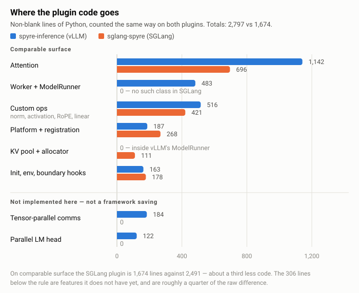
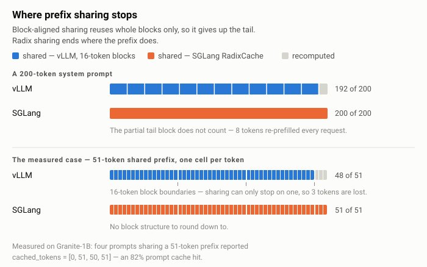

# A Growing Stack: Bringing SGLang to Spyre

Ask a 1B model for the capital of France, the freezing point of water, the first
three prime numbers, and what comes after 1, 2, 3, 4, 5, 6, 7. Run it twice:
once with attention on CPU, once with every attention layer executing on an IBM
Spyre AIU. The two runs produce byte-identical text, token for token, 24 tokens
deep, on all four prompts.

The Spyre run is also six times slower than the CPU it agrees with.

And a third configuration, the one that keeps the KV cache on the accelerator
where it belongs, runs twice as fast as that — and answers the prime-numbers
question with "1, 2, 3, 4, 5".

All three of those facts are the point. This post is about what it took to get
SGLang serving on Spyre, what the framework gave us for free, what it didn't,
and what the measurements said once we stopped assuming we knew.

## What actually runs

The Spyre stack already had one way to serve models: the `spyre-inference`
plugin for vLLM, which is the production path. We wanted a second one, for
reasons we'll get to. The result is an out-of-tree SGLang platform plugin that
SGLang discovers through its own `sglang.srt.platforms` entry point — no fork,
no vendored copy of the framework.

It runs in a few configurations, selected by `attention_backend` on
`sgl.Engine`:

- **`torch_native`** — the CPU baseline. SGLang's RadixCache scheduler, no
  Spyre compute. This is the control.
- **`spyre`** — every attention layer runs the full `_attn_4d` kernel
  (q@kᵀ, softmax, p@v) on the AIU, using the same shape conventions as
  `spyre-inference`: KV bucketed to 256, query bucketed to 32. The KV cache
  stays in SGLang's CPU pool.
- **`spyre` with the model body on device** — RMSNorm, SiluAndMul, RoPE and
  the Linear layers also execute on Spyre, with the residual stream staying
  resident across the forward pass so the CPU↔Spyre boundary is crossed once
  per forward instead of once per attention layer.
- **`spyre_paged`** — the KV cache itself living on the device. This one runs,
  and it's the fastest of the three Spyre modes, but it currently computes the
  wrong answer. That story is worth telling properly and we come back to it
  below.

All of them run the same SGLang scheduler, which is the point. Send four prompts
that share a 51-token system prompt and the scheduler reports:

```
cached_tokens = [0, 51, 50, 51]
```

The first request pays for the 51-token prefix; the next three are handed it for
free, on an accelerator that has no idea any of this is happening.

<!-- REVIEW NOTE (remove before publishing): two things to settle here.
     (1) This cached_tokens array is the one figure in the post carried over
     from the repo (sglang_oot_patches/README.md) rather than re-measured in
     the 2026-07-26 sweep. Re-run tests/test_radix_demo.py to confirm.
     (2) The repo also reports this as an "82% prompt cache hit", and that
     percentage does NOT reconcile with the array under the obvious reading:
     152 cached tokens over four prompts that must each be >= 51 tokens is at
     most 152/204 = 74.5%. It only reaches 82% if the denominator excludes the
     cold first request (152/186 = 81.7%). The bare percentage has been left
     out of the prose deliberately — a reader can do that division in ten
     seconds. Work out which definition SGLang is reporting before quoting any
     percentage. -->

That last part is the design worth noticing. Prefix sharing is not something the
backend participates in. SGLang's RadixCache lives in the scheduler proper,
resolves the shared prefix to KV-pool slots before the forward begins, and hands
the attention backend a `req_to_token` table that already encodes the hit. From
the device's perspective, a cache hit is simply work that never arrives.

## Why it took a third less code

Counted the same way on both sides — non-blank lines of Python, plugin code
only, no tests — `spyre-inference` is 2,797 lines and the SGLang plugin is
1,674. Both target the same hardware, call the same Spyre kernels, and work
around the same toolchain constraints. The ratio holds under raw line counting
too (3,416 against 2,021), so it isn't an artifact of how we counted.

Where that difference sits is more interesting than its size.

<picture>
  <source media="(prefers-color-scheme: dark)" srcset="figures/plugin-size-by-component-dark.svg">
  
</picture>

| Component | spyre-inference (vLLM) | sglang-spyre (SGLang) |
|---|---:|---:|
| Attention | 1,142 | 696 |
| Worker + ModelRunner | 483 | 0 |
| Custom ops (norm, activation, RoPE, linear) | 516 | 421 |
| Platform + registration | 187 | 268 |
| KV pool + allocator | inside ModelRunner | 111 |
| Init, env, boundary hooks | 163 | 178 |
| **Comparable subtotal** | **2,491** | **1,674** |
| Tensor-parallel communicator | 184 | 0 |
| Parallel LM head | 122 | 0 |
| **Total** | **2,797** | **1,674** |

One deduction to make before drawing any conclusion from that. The bottom two
rows are things the SGLang plugin doesn't do at all: there's no tensor-parallel
communicator because we don't support TP > 1, and no on-device LM head. That's
306 lines, roughly a quarter of the gap, and it's a missing feature rather than
a framework saving. On comparable surface the comparison is 1,674 against
2,491 — about a third less code, which is the number we'd defend.

The largest single contributor isn't attention. It's the 483-line Worker and
ModelRunner block, which has no counterpart at all. vLLM asks you to subclass
`Worker` and `ModelRunner`, own the per-process model, KV pool and sampler, and
implement `execute_model()` as the per-step entry point. SGLang asks for a
platform object with factory methods and an `init_backend()` lifecycle hook.
There is no worker to write, so there is no worker in the table.

Attention is second, at 446 lines, and the reason is one design decision.
vLLM's `AttentionBackend` is an interface: every plugin reimplements KV gather,
block-table interpretation, extend-versus-decode dispatch, and GQA and causal
handling. SGLang ships `TorchNativeAttnBackend`, a real base class with working
defaults in pure torch. Our Spyre backend subclasses it and overrides exactly
one seam — the inner SDPA call — swapping `F.scaled_dot_product_attention` for
the bucketed `_attn_4d`:

```python
class SpyreAttnBackend(TorchNativeAttnBackend):
    """Reuse TorchNativeAttnBackend; swap only the SDPA seam."""

    # The base class hands these the already-gathered query and the KV
    # buffers, and expects results written into `output` in place. Note
    # enable_gqa / causal / sliding_window arrive resolved — the base worked
    # them out, so the device code never has to.
    def _run_sdpa_forward_extend(
        self, query, output, k_cache, v_cache,
        req_to_token, req_pool_indices, seq_lens,
        extend_prefix_lens, extend_seq_lens,
        encoder_lens=None, scaling=None, enable_gqa=False,
        causal=False, is_cross_attn=False, sliding_window_size=None,
    ):
        return self._spyre_sdpa(...)   # bucketed _attn_4d, on the AIU

    def _run_sdpa_forward_decode(self, query, output, k_cache, v_cache, ...):
        return self._spyre_sdpa(...)
```

That's the whole device-specific surface for attention. The KV gather, the pool
save, the extend-versus-decode dispatch, the GQA and causal handling: all
inherited, none rewritten. The 696 lines on our side are mostly the bucketing
and shape gymnastics `_attn_4d` needs, not framework plumbing.

A third saving doesn't show up as its own row, because it's spread across the
ones above: there is no dual-buffer dance. vLLM V1's sampler runs CPU-side and
expects integer inputs — token IDs, positions — to arrive on CPU while model
tensors live on the device, so `spyre-inference` carries a `_SpyreModelWrapper`
doing that conversion at the model boundary on every single forward. In SGLang's
attention-only mode no staging is required at all, and in the on-device-body
mode about ten lines of boundary hooks cover the same ground.

Two rows run the other way, and they're the honest cost of the trade. Our KV
pool and allocator are 111 lines that vLLM appears to spend nothing on — but
only because vLLM's equivalent is buried inside that 483-line ModelRunner
rather than being free. Having it as a separate, subclassable
`MHATokenToKVPool` is what makes device-resident KV a contained change instead
of a rewrite.

Our platform layer is genuinely bigger too, 268 lines against 187, because
SGLang front-loads into the platform object what vLLM spreads across a Worker:
factories for the KV pool, the allocator and the attention backend, plus device
identity and registration. That's the shape of the trade. At this ratio we'd
take it every time, but it isn't free.

We also deleted code we'd written. An early version had a hand-rolled
`SpyreEagerGraphRunner`, until we found that SGLang core handles it. The right
amount of code for that problem was zero.

What's in core is more pointed than a lucky default. At the version we targeted,
`model_runner.py` reads:

```python
elif current_platform.is_out_of_tree():
    self.init_attention_backend()
    if current_platform.support_cuda_graph():
        self.init_device_graphs()
    else:
        self.graph_runner = None
        self.graph_mem_usage = 0
```

An explicit branch for out-of-tree platforms, sitting beside the CUDA and ROCm
paths, that quietly does the right thing for a device with no graph capture.
`is_out_of_tree()` is consulted at three separate points in that one file. This
is the difference between a framework that *tolerates* a new backend and one
that has a concept for it: somebody wrote that branch before we arrived, for a
device they had never seen.

One more structural detail that matters on this hardware: SGLang addresses the
KV cache per token (`req_to_token[req, slot] → token_idx`) where vLLM addresses
it per block (`block_table[seq, page] → block_id`). Page size never has to
thread through the Spyre kernels, `page_size=1` works without special cases,
and the 256-token KV bucketing stays a decision local to the kernel dispatcher
rather than a property of the storage layout. It's also a closer fit for the
indexed-gather lowering Spyre is moving toward.

## What the framework didn't do for us

A good extension surface lowers the cost of integration. It does not eliminate
it, and claiming otherwise would be easy to disprove by cloning the repo.

We ship four patches against installed SGLang. They're small, idempotent, and
each one is a place where SGLang core assumes that a non-CUDA device must be
NPU, XPU or MPS, and doesn't yet consider that an out-of-tree platform might
exist:

1. `memory_pool_host.py` imports a CUDA `sgl_kernel` for every device that
   isn't NPU/XPU/MPS. Spyre has no `libcudart`. Fix: also require `_is_cuda`.
2. The rotary embedding base falls back to `from vllm._custom_ops import
   rotary_embedding` on non-CUDA paths, hard-requiring vLLM. Fix: make the
   import optional and fall back to torch-native RoPE, which is what CPU and
   NPU already do.
3. `support_triton()` returns `True` for any backend not explicitly excluded,
   so `"spyre"` gets treated as Triton-capable and the allocator dispatches a
   Triton kernel into `RuntimeError: 0 active drivers`. Fix: exclude the Spyre
   backends.
4. `SUPPORTED_DEVICES` is a whitelist that rejects anything unlisted, so
   `device="spyre"` raises at the first `load_model`. Fix: add it.

That's four one-line changes, none of them Spyre-specific in substance — they're
SGLang out-of-tree readiness gaps that the next new backend would hit too. We'd
rather report that accurately than claim a zero-friction integration, because
"we needed four one-line fixes and all four belong upstream" is a stronger
statement about API quality than "we needed nothing" would be.

And then something better happened, which we only noticed while fact-checking
this post. Three of those four are already fixed upstream.

We pinned to `v0.5.12.post1`, where all four gaps are present exactly as
described. On a main-line checkout a couple of weeks later, `memory_pool_host`
guards on `_is_cuda or _is_hip`, the rotary base excludes out-of-tree platforms
from the vLLM-kernel path with `and not (current_platform.is_out_of_tree())`,
and `device_config` reads `if device in SUPPORTED_DEVICES or
current_platform.is_out_of_tree()`. Each of those is a better fix than ours: we
added `"spyre"` to a list, upstream taught the check to ask what kind of
platform it is talking to.

Only `support_triton()` still returns `backend not in ["torch_native",
"intel_amx"]`, so a non-Triton out-of-tree backend is still assumed
Triton-capable and gets routed into a kernel it can't run — surfacing as
`RuntimeError: 0 active drivers` from inside the KV-cache allocator, a good
distance from anything the backend author wrote.

That one is a genuine, isolated upstreaming opportunity, so we've written it up
as a proposal rather than just complaining about it:
[`sglang_oot_patches/upstream/`](../sglang_oot_patches/upstream/support-triton-platform-predicate.md).
The shape follows the three fixes above — make Triton capability a platform
predicate next to the existing `support_cuda_graph()`, defaulting out-of-tree
platforms to `False` and letting one with Triton opt back in. In-tree behaviour
is unchanged. Our current patch adds `"spyre"` to a list, which fixes one device
rather than the category; this fixes the category.

None of this was on our account — we hadn't filed anything. It happened because
SGLang is actively growing out-of-tree support while we were building on it,
which is a more useful thing to know about a framework than any line count.

Beneath the framework layer, the device had its own opinions. `libspyre_comms.so`
reads `RANK`, `WORLD_SIZE`, `LOCAL_RANK` and `LOCAL_WORLD_SIZE` at dlopen time;
set them late and the runtime corrupts quietly, surfacing hundreds of frames
deep in Dynamo as a `meta_tensor` no-dispatch assertion that tells you nothing
about the actual cause. The first FX trace of any Spyre op crashes without an
`addmm` decomposition override. `flashinfer` raises an `AssertionError` at
import when it can't find libcudart, which SGLang's `try/except ImportError`
correctly declines to catch. None of these are framework problems, and all of
them cost real time.

The most expensive one wasn't in either layer. A development pod picked up a
`torch_spyre` built weeks earlier against a `flex` runtime symbol that had since
been removed, so every mode died at the first tensor transfer with an
`undefined symbol` error that looks, at a glance, exactly like a broken plugin.

The reflex is to rebuild, and the reflex is wrong twice over. The source tree
lived on a volume shared with other people's running jobs, and a matching build
was already installed elsewhere on the same machine. So the fix was to shadow the
stale editable install rather than replace it. That works because setuptools
appends its editable finder to `sys.meta_path`, *behind* the standard
`PathFinder`, which means an ordinary `PYTHONPATH` entry takes precedence and
nothing shared has to be touched at all. Worth knowing before you reach for a
compiler on a machine you share with colleagues.

## The numbers, honestly

Two things are worth separating here: whether the kernels compute the right
answer, and how fast they do it. The first result is much better than the
second.

**Correctness.** The four prompts in the opening were chosen because their
greedy continuations are unambiguous. Greedy decoding is deterministic, so a
correct attention kernel has no licence to differ from the CPU baseline by even
one token — a cheap, sharp test with no tolerance to argue about. Both working
Spyre modes pass it: 24 generated tokens per prompt, byte-identical to CPU SDPA,
on all four.

A fifth prompt, deliberately open-ended, does diverge. It stays identical for 78
characters and then splits at exactly the point where the model falls into a
repetition loop and its top logits are effectively tied. That is bf16 rounding
changing an argmax where the model has no preference, rather than a masking or
bucketing error — and it is why the fifth prompt is in the set at all. A check
that only ever agrees isn't telling you much.

Running the same check with the model body also on the device gives output
byte-identical to the attention-only mode. That clears the on-device RMSNorm,
SiluAndMul, RoPE and Linear paths, and localises any residual numerical
difference to `_attn_4d` alone.

If you are bringing a framework up on new silicon, this check is cheap and we'd
recommend it early — with one trap worth naming, because we fell into it. The
verdict has to key on *which* prompts diverge, not how many.

Our first comparator reasoned from counts alone: all matched meant pass, none
matched meant broken, and anything between was called benign rounding noise. So
when the paged backend scored three out of five, the harness duly reported bf16
noise — even though one of the two failures was a prompt with a right answer,
missed at the very first token. A divergence on an unambiguous prompt is a
defect; one on the open-ended prompt is expected. Score them alike and the
harness will confirm whatever you hoped.

**Throughput.** All modes measured in one sitting on one machine — Granite-1B
(`micro-g3.3-8b-instruct-1b`, 4 layers, 32 query heads over 8 KV heads), 200
output tokens, batch of one, one Spyre PF card:

| Mode | TPS | ms/token | What runs on Spyre |
|---|---:|---:|---|
| `torch_native` (CPU baseline) | 37.64 | 26.6 | nothing |
| `spyre` | 6.13 | 163.2 | `_attn_4d`; KV on CPU |
| `spyre` + model body on device | 6.56 | 152.4 | Linear, RMSNorm, SiluAndMul, RoPE, attention |
| `spyre_paged` | (12.39) | (80.7) | KV on device — **fails parity, see below** |

The baseline needs its terms stated or the table misleads: it is an
unconstrained 144-core Xeon 6736P with 1.5 TB of RAM, and SGLang used one of its
two NUMA nodes. So this is seventy-odd server cores against a single accelerator
at batch size one — not a hardware comparison anyone should draw a conclusion
from, and we publish it because the shape of the gap is informative even though
its magnitude isn't a verdict.

Two things in that table are worth pointing at. Moving the model body onto the
device *helps* — 6.56 against 6.13 — which is the direction the design predicts,
since the residual stream stays resident and the CPU↔Spyre boundary is crossed
once per forward instead of once per attention layer. But the gain is 7%, far
short of what that reasoning implies, and it costs 50% longer model load
(143.8 s against 96.6 s) to place the weights.

The `spyre_paged` row is parenthesised because it is not a result. That mode
keeps the KV cache on the device and runs at 12.39 TPS — twice either working
mode, exactly as the design predicts, since a prefix hit then avoids re-transfer
as well as recompute.

But it fails the parity check. On "The first three prime numbers are" it diverges
from CPU at the very first generated token and answers "1, 2, 3, 4, 5…", where
both correct modes get that prompt right. The number is real and the answer is
wrong, and a wrong answer arriving twice as fast is not a speedup. We report it
only to be clear about what is and isn't established.

That path taught us something about our own documentation, too. It had been
recorded as blocked on the Spyre toolchain's stick-layout constraints. It
wasn't: it was crashing on a token-count bug of ours — extend-mode metadata used
the full sequence length where `q` only carries the newly-extended tokens, which
are equal on a cold prefill and diverge on exactly a RadixCache prefix hit. The
on-device-radix backend was broken by the one thing it exists to do. Fixing that
got it running, and running is what exposed the second, still-open defect in the
gather path. Two bugs wearing one trench coat, and the outer one had been
misattributed to the vendor toolchain.

The reasons for the overall gap are understood and mostly not about SGLang. In
the two correct modes the prefix KV lives on CPU, so a RadixCache hit saves
recomputation but not re-transfer — the scheduler correctly skips the prefill,
then every forward uploads the prefix KV anyway. `num_seqs == 1` is hard-coded in
both plugins' attention backends, so continuous batching, the thing that makes
serving throughput interesting, isn't in play at all. And the static-shape
compilation regime described in the next section means even a warm run pays
dispatch overhead a fused GPU kernel wouldn't.

A comparison against vLLM on the same hardware would be the useful next
measurement, and we don't have one taken under these conditions. We'd rather
leave that blank than quote a number from a different machine — which is exactly
the mistake an earlier draft of this table made.

There is one genuinely large number, and it's about compile caching rather than
compute. On a short 8-token generation, the first request takes 22.3 seconds
while the Spyre kernels compile; the second takes 0.8. That ~28× is a real
property of the deployment model — it says warm pods matter — but it isn't a
throughput result and shouldn't be read as one.

## What changes next

Most of the gap above traces to a single constraint: Spyre's toolchain is
currently static-shape. Every distinct query and KV bucket is a separate
compiled graph. Runtime tensor indexing isn't expressible, so the on-device KV
path has to fake it — build an `[N_blocks, block_size, num_blocks]` one-hot
tensor on CPU, transfer it, and use a batched matmul as a runtime-indexable
gather. That's what `spyre_paged` does. Interestingly, the measurement above
suggests the one-hot BMM is *not* the bottleneck we had assumed — of the three
Spyre modes it is the fastest, once it runs at all — but it is also the one that
computes the wrong answer, so its cost profile shouldn't be trusted until the
gather is fixed.

The dynamic-shapes refactor underway in the Spyre toolchain addresses exactly
this. Variable-length attention without bucketing, `num_seqs > 1`, and — the
one we care about most — KTIR `construct_indirect_access_tile` lowering, which
replaces the one-hot BMM with real `cache[block_table[i]]` indirection.

That's the point where the architecture stops being theoretical. RadixCache's
advantage over block-level prefix sharing is that it shares at any token
boundary, where a block-paged cache has to round down to the last whole block
and re-prefill the remainder.

<picture>
  <source media="(prefers-color-scheme: dark)" srcset="figures/prefix-sharing-granularity-dark.svg">
  
</picture>

On its own, three tokens is nothing. The point is that it isn't on its own: the
same tail is given up by every request that shares the prefix, and the shortfall
grows with how badly the prefix length misses a block boundary. For RAG with
shared templates, multi-turn chat, and agent flows with long tool prompts —
workloads where prefix lengths are set by application code and have no reason to
land on multiples of sixteen — that's the lever.

What it needs is a *correct* on-device KV path. The cache already lives on the
device in `spyre_paged`, and that mode is already the fastest of the Spyre
modes; what stands between it and a real result is the gather defect, not the
architecture.

## The part that outlasts the numbers

Here's the argument for doing this now, while the numbers are still
unimpressive.

The Spyre stack is moving. The lowering is being rewritten, the shape regime is
changing, kernels are being tuned. For anything sitting on top of that, the
useful question isn't "does it run today" but "does it help or hurt the next
time something underneath changes."

A full serving framework turns out to be a good regression harness, and not
incidentally. Several of the sharpest bugs we hit were only visible through the
complete path. The `support_triton` allowlist silently routing the allocator into
a CUDA-driver-dependent kernel is not something a unit test on the attention
backend would ever surface, because the allocator isn't part of the attention
backend. Neither is the memory-pool host import, nor the RoPE fallback reaching
for vLLM. Those are integration failures, and they need an integration to find
them.

Now that SGLang runs end-to-end on the AIU, every change to the Spyre stack has a
realistic serving workload to be checked against, with real scheduling, real
cache reuse and a real request loop. That beats a purpose-built script, which by
construction only exercises what we already thought to test.

And because the integration rides on entry points and subclassable base
classes, with a handful of upstreamable patches rather than a fork to reconcile —
three of which upstream has since closed on its own — keeping
it current is cheap. That was the actual reason to be careful about *how* we
integrated, more than the line count.

## Not the only one through this door

While we were writing this up, RadixArk and Google
[announced](https://www.lmsys.org/blog/2026-07-30-sglang-google-tpu)
`SGL-torchtpu` — SGLang on Google's TPUs, with Radix Cache, quantization,
speculative decoding and several parallelism strategies on the roadmap.

We found out after the work described here was already running, which is the
reassuring part. Two teams, with no contact and very different silicon, reached
for the same framework to serve on non-GPU hardware at roughly the same moment.
That is a better signal about SGLang's extension points than anything we could
conclude from our own line counts.

It also changes what to do about the rough edges. A CUDA-only import and a Triton
assumption are mild annoyances if we're the only ones who ever hit them, and
worth upstreaming if every new backend hits them in turn. On the evidence, it's
the second. Every backend that follows then pays the cost once less.

## Where this leaves things

Spyre now runs SGLang. It's a prototype: single tenant, batch of one, no tensor
parallelism, on-device KV running but incorrect, and no configuration that beats
CPU on a 1B model yet. All of that is written down in the repo alongside the
parts that work.

What's genuinely established is the shape of the thing. RadixCache scheduling
and Spyre compute coexist end-to-end, and the attention kernel reproduces CPU
output token for token. The plugin surface holds up: a platform registered
through a documented entry point, an attention backend that inherits almost
everything, a KV pool one method away from device residency. And on comparable
functionality the integration cost is about a third less than the same job took
against vLLM, for structural reasons that won't change when the toolchain does.

Two frameworks on one accelerator isn't a competition to resolve. They're good
at different things — vLLM's continuous batching scheduler has three more years
of tuning behind it and a broader serving-feature matrix, and SGLang's
any-length prefix sharing is the better fit for shared-prompt workloads. The
useful outcome is having both, and knowing concretely which one to reach for.

The plugin lives at
[`torch-spyre/sglang-spyre`](https://github.com/torch-spyre/sglang-spyre). The
README covers the runtime modes and the setup gotchas; `docs/sglang-vs-vllm.md`
has the full framework comparison and the measured numbers, including the ones
that contradict what we expected. The four SGLang patches are in
`sglang_oot_patches/` as individual diffs, ready to be argued about upstream.

The failure modes are documented alongside the parts that work, and the gotchas
that cost us days are written down so they don't cost anyone else the same. If
you work on inference frameworks, accelerators, or the glue between them, we'd
welcome the company.
